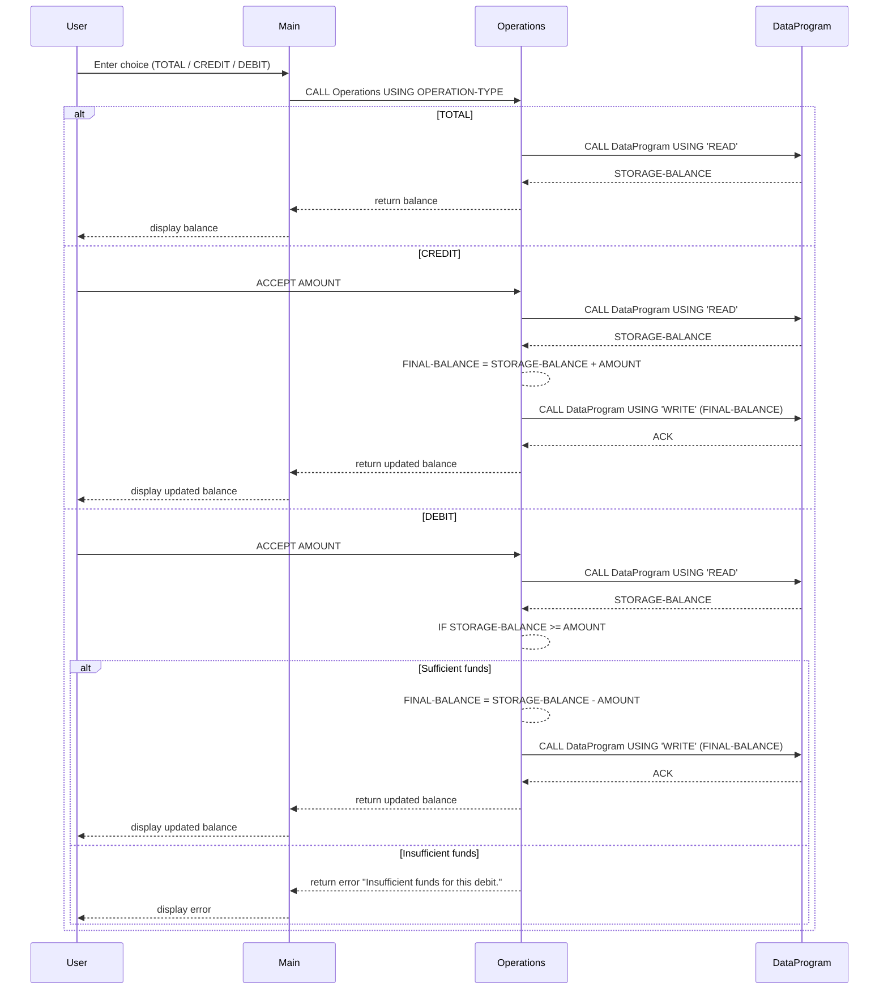

# COBOL Account Management — Documentation

This document describes the purpose of each COBOL source file in the `src/cobol` folder, the key variables/routines, and the business rules for the sample student-account program.

## Purpose of source files

- [src/cobol/main.cob](src/cobol/main.cob#L1): User-facing menu and main program loop. Presents options to view balance, credit, debit, or exit. Reads the user's menu choice and calls `Operations` with the appropriate operation code.
- [src/cobol/operations.cob](src/cobol/operations.cob#L1): Implements request handling for `TOTAL`, `CREDIT`, and `DEBIT`. Accepts amounts from the user, performs arithmetic to compute the resulting balance, enforces debit rules, and calls the `DataProgram` to read or write the stored balance.
- [src/cobol/data.cob](src/cobol/data.cob#L1): Simple in-memory data program that stores the account balance in working-storage. Exposes `READ` (return current balance) and `WRITE` (update balance) entry points via the linkage section.

## Key variables and routines

- `USER-CHOICE` (in main.cob): numeric menu selection (1-4).
- `OPERATION-TYPE` / `PASSED-OPERATION` (operations.cob / data.cob): fixed-width 6-character operation code (examples: `TOTAL `, `CREDIT`, `DEBIT `). Trailing spaces matter for comparisons.
- `AMOUNT` (operations.cob): amount entered by the user for credit/debit. Declared as `PIC 9(6)V99` (supports values up to 999,999.99).
- `FINAL-BALANCE` (operations.cob): working result after applying credit/debit.
- `STORAGE-BALANCE` (data.cob): persistent-in-process stored balance (working-storage in `DataProgram`). Initially set to `1000.00`.
- `DataProgram` entry points: `READ` — returns `STORAGE-BALANCE` to caller; `WRITE` — accepts a balance value and updates `STORAGE-BALANCE`.

## Business rules (student accounts)

- Initial balance: starts at `1000.00` (hard-coded in the sample).
- View balance (`TOTAL`): reads and displays the current stored balance.
- Credit: accepts any positive `AMOUNT` and adds it to the stored balance; writes the updated balance back to `DataProgram`.
- Debit: only allowed if sufficient funds exist. The operation compares `FINAL-BALANCE` against `AMOUNT` and rejects the debit with the message "Insufficient funds for this debit." when funds are insufficient — no overdrafts allowed.
- Numeric limits: fields use `PIC 9(6)V99`, so the maximum representable value is `999,999.99`. The code does not perform explicit bounds validation, so very large inputs may overflow.
- Persistence: the balance is stored only in program memory (working-storage) and is not written to disk; on each run the balance resets to the initial value.

## Maintenance notes

- Preserve the exact parameter order and types when refactoring `CALL ... USING` between programs.
- Keep operation codes padded to 6 characters when constructing or comparing them.
- To add real persistence, replace the in-memory `STORAGE-BALANCE` handling in `DataProgram` with file or database I/O.

## Source files (quick links)

- [src/cobol/main.cob](src/cobol/main.cob#L1)
- [src/cobol/operations.cob](src/cobol/operations.cob#L1)
- [src/cobol/data.cob](src/cobol/data.cob#L1)

---
## Sequence diagram

The following Mermaid sequence diagram shows the data flow between the user, `main.cob`, `operations.cob`, and `data.cob` for the `TOTAL`, `CREDIT`, and `DEBIT` operations.

Generated on March 16, 2026.
